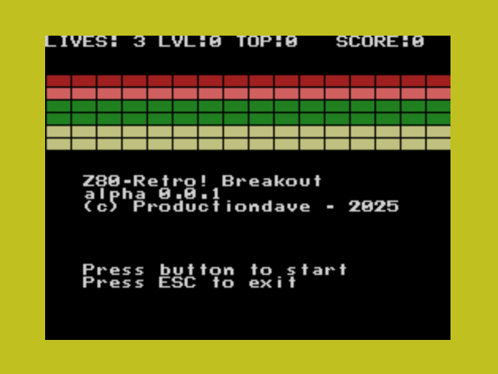

# Z80-Breakout

This is a simple breakout clone.  It has two levels of play.  Once you clear the
first screen, you get one new life and then bricks are a little stronger.  Once
you clear the second screen, the game is over.

## BUILD

You will need the following dependencies:

- [z80-compiler-kit-libcpm](https://github.com/linuxplayground/z80-compiler-kit-libcpm)
- [Fuzix-Compiler-Kit](https://codeberg.org/EtchedPixels/Fuzix-Compiler-Kit)
- [Fuzix-Bintools](https://codeberg.org/EtchedPixels/Fuzix-Bintools)
Check the Make.rules file for paths etc.  Then run `Make`.

Check the [releases link](https://github.com/linuxplayground/releases) for
latest pre-compiled COM files.

<-- vim: set ft=markdown ts=4 sw=4 tw=80 cc=80: -->
